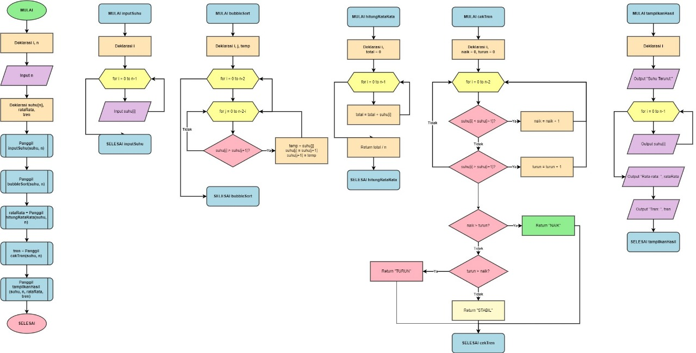

# 🌡 PROGRAM REKAP DATA CUACA HARIAN

*Program analisis suhu harian dan tren temperatur menggunakan C++*

## 📊 Status Progres: 100% ✅

*Semua fitur telah diimplementasikan dan teruji dengan sempurna!*

- ✅ 5 Fungsi Utama Selesai (Input, Bubble Sort, Hitung Rata-rata, Cek Tren, Tampilkan)
- ✅ Bubble Sort - Pengurutan suhu dari rendah ke tinggi
- ✅ Sequential Analysis - Analisis tren perubahan suhu
- ✅ Statistical Calculation - Perhitungan min, max, dan rata-rata
- ✅ Input Validation - Validasi lengkap untuk semua kondisi

## ✨ Fitur yang Sudah Selesai

✅ *Array 1 Dimensi* - Penyimpanan data suhu harian
✅ *Input Fleksibel* - Dapat menerima data 1-1000 hari
✅ *Fungsi Modular* - 5 fungsi terpisah untuk kemudahan maintenance
✅ *Bubble Sort* - Pengurutan data dengan kompleksitas O(n²)
✅ *Analisis Tren* - Counting approach untuk menentukan tren (NAIK/TURUN/STABIL)
✅ *Statistical Analysis* - Min, max, dan rata-rata suhu
✅ *Edge Case Handling Lengkap* - Validasi input <= 0, > 1000, dan input non-numerik
✅ *Tampilan Terformat* - Output menggunakan iomanip untuk presentasi profesional
✅ *Input Validation* - Error handling untuk input yang tidak valid

## 🎯 Ketentuan Project ✅

Program ini dibuat sesuai ketentuan project dengan spesifikasi berikut yang *SEMUA SUDAH TERPENUHI*:

| Ketentuan | Status | Keterangan |
|-----------|--------|-----------|
| Menggunakan array 1 dimensi | ✅ | Array suhu[] dan suhuAsli[] |
| Minimal 5 fungsi/prosedur | ✅ | 5 fungsi yang sudah diimplementasikan |
| Implementasi Bubble Sort | ✅ | Mengurutkan suhu ascending - O(n²) |
| Analisis tren suhu | ✅ | Counting approach (NAIK/TURUN/STABIL) |
| Validasi input lengkap | ✅ | Validasi n <= 0, n > 1000, input non-numerik |
| Perhitungan statistik | ✅ | Min, max, dan rata-rata suhu |
| Dokumentasi lengkap | ✅ | README ini |

---

## 📚 Informasi Proyek

- *Mata Kuliah:* Praktik Algoritma
- *Program Studi:* Teknologi Informasi
- *Universitas:* Universitas Negeri Yogyakarta (UNY)
- *Dosen Pengampu:* Muhammad Resa Arif Yudianto M.Kom.

*Anggota Kelompok:*
- Daffa Taufiqurahman (24051130086)
- Fajri Rahmanto (24051130099)

## 📦 Struktur Data

cpp
// Deklarasi di main()
int n;                                // Jumlah hari yang diinput user
int suhu[n];                          // Array untuk data suhu (akan di-sort)
int suhuAsli[n];                      // Array untuk data asli (untuk analisis tren)
double rataRata;                      // Rata-rata suhu (tipe double untuk presisi)
string tren;                          // Tren: "NAIK", "TURUN", atau "STABIL"

// Batasan Program
const int MIN_HARI = 1;               // Minimal 1 hari
const int MAX_HARI = 1000;            // Maksimal 1000 hari

## 🔧 Fungsi-Fungsi Utama

| No | Fungsi | Return Type | Parameter | Status | Deskripsi |
|----|--------|-------------|-----------|--------|-----------|
| 1 | inputSuhu() | void | int suhu[], int n | ✅ | Input data suhu dengan validasi cin.fail() dan loop retry |
| 2 | bubbleSort() | void | int suhu[], int n | ✅ | Mengurutkan suhu ascending dengan nested loop optimized |
| 3 | hitungRataRata() | double | const int suhu[], int n | ✅ | Menghitung rata-rata dengan casting (double) untuk presisi |
| 4 | cekTren() | string | const int suhu[], int n | ✅ | Analisis tren dengan counting naik/turun, return string |
| 5 | tampilkanHasil() | void | const int suhu[], int n, double rataRata, string tren | ✅ | Output terformat dengan setw() dan setprecision(2) |
| 6 | main() | int | - | ✅ | Orchestration: validasi n, copy array, call semua fungsi |

## 🚀 Cara Kompilasi & Menjalankan

### *Windows (MinGW/g++)*
bash
g++ -o CatatanSuhuMingguan.exe CatatanSuhuMingguan.cpp
CatatanSuhuMingguan.exe

### *Linux/Mac*
bash
g++ -o CatatanSuhuMingguan CatatanSuhuMingguan.cpp
./CatatanSuhuMingguan

### *VS Code (dengan task)*
bash
Tekan Ctrl+Shift+B → pilih "C/C++: g++.exe build active file"

## 💡 Contoh Penggunaan

### *1. Input Jumlah Hari*

========================================
  PROGRAM REKAP DATA CUACA HARIAN
========================================
Analisis Suhu Harian dan Tren Temperatur
========================================

Masukkan jumlah hari: 7

### *2. Input Data Suhu*

========================================
INPUT DATA SUHU
========================================
Masukkan data suhu harian (dalam Celcius):
Hari ke-1 : 25
Hari ke-2 : 27
Hari ke-3 : 26
Hari ke-4 : 28
Hari ke-5 : 30
Hari ke-6 : 29
Hari ke-7 : 31

Data berhasil diinput!
Data berhasil diurutkan!

### *3. Hasil Analisis*

========================================
       HASIL ANALISIS SUHU HARIAN
========================================

SUHU TERURUT (Rendah ke Tinggi):
----------------------------------------
Hari ke-  1 :   25 C
Hari ke-  2 :   26 C
Hari ke-  3 :   27 C
Hari ke-  4 :   28 C
Hari ke-  5 :   29 C
Hari ke-  6 :   30 C
Hari ke-  7 :   31 C

----------------------------------------
STATISTIK:
----------------------------------------
Jumlah Data    : 7 hari
Suhu Terendah  : 25 C
Suhu Tertinggi : 31 C
Rata-rata Suhu : 28.00 C
Tren Suhu      : NAIK
========================================

========================================
PROGRAM SELESAI
========================================

## ⚠ Edge Cases yang Ditangani

| Situasi | Respons Program | Status | Penjelasan |
|---------|----------------|---------|-----------|
| Jumlah hari <= 0 | ❌ ERROR: Jumlah hari harus lebih dari 0! | ✅ | Mencegah input tidak valid |
| Jumlah hari > 1000 | ❌ ERROR: Jumlah hari terlalu besar! | ✅ | Mencegah overflow memory |
| Input suhu non-numerik | ❌ ERROR: Input harus berupa angka! | ✅ | Validasi tipe data dengan cin.fail() |
| Input suhu berhasil | ✓ Data berhasil diinput! | ✅ | Konfirmasi input valid |
| Sorting berhasil | ✓ Data berhasil diurutkan! | ✅ | Konfirmasi proses sorting |

## 📊 Algoritma yang Diimplementasikan ✅ LENGKAP

### *1. Bubble Sort* ✅ LENGKAP
- *Lokasi:* Fungsi bubbleSort()
- *Kompleksitas Waktu:* O(n²) - Quadratic Time (Worst & Average case)
- *Kompleksitas Ruang:* O(1) - Constant Space (In-place sorting)
- *Cara Kerja:*
  - Nested loop membandingkan elemen yang berdekatan
  - Tukar posisi jika elemen kiri > elemen kanan
  - Ulangi hingga seluruh array terurut ascending
  - Outer loop berkurang 1 setiap iterasi (optimization)
- *Keunggulan:* In-place sorting, stabil, mudah dipahami
- *Kekurangan:* Tidak efisien untuk data besar (> 10,000 elemen)
- *Penggunaan:* Mengurutkan suhu dari rendah ke tinggi

*Contoh:*

Pass 1: [30, 25, 28] → [25, 30, 28] → [25, 28, 30]
Pass 2: [25, 28, 30] → Sudah terurut ✓

### *2. Counting Approach (Analisis Tren)* ✅ LENGKAP
- *Lokasi:* Fungsi cekTren()
- *Kompleksitas Waktu:* O(n) - Linear Time
- *Kompleksitas Ruang:* O(1) - Constant Space
- *Cara Kerja:*
  - Iterasi setiap pasangan elemen berurutan
  - Hitung naik jika suhu[i] < suhu[i+1]
  - Hitung turun jika suhu[i] > suhu[i+1]
  - Bandingkan counter naik dan turun untuk tentukan tren
- *Keunggulan:* Sederhana, efisien, tidak perlu data terurut
- *Penggunaan:* Menentukan tren suhu (NAIK/TURUN/STABIL)

*Logika:*

Untuk setiap pasangan berurutan:
  - Jika suhu[i] < suhu[i+1] → counter NAIK++
  - Jika suhu[i] > suhu[i+1] → counter TURUN++
  - Jika suhu[i] = suhu[i+1] → tidak dihitung

Hasil:
  - NAIK > TURUN → Tren "NAIK"
  - TURUN > NAIK → Tren "TURUN"
  - NAIK = TURUN → Tren "STABIL"

### *3. Accumulation Algorithm (Rata-rata)* ✅ LENGKAP
- *Lokasi:* Fungsi hitungRataRata()
- *Kompleksitas Waktu:* O(n) - Linear Time
- *Kompleksitas Ruang:* O(1) - Constant Space
- *Cara Kerja:*
  - Akumulasi semua nilai suhu
  - Bagi total dengan jumlah data
  - Return hasil dalam tipe double
- *Keunggulan:* Sederhana, efisien, presisi desimal
- *Penggunaan:* Menghitung rata-rata suhu

---

## 📊 Flowchart Program

Flowchart menunjukkan alur kerja program dari input hingga output hasil analisis suhu.

### Penjelasan Flowchart:

*1. Main Program (Kiri)*
- START → Input jumlah hari
- Deklarasi array suhu[] dan suhuAsli[]
- Panggil fungsi-fungsi utama
- END

*2. Fungsi inputSuhu() (Tengah Kiri)*
- Loop input data suhu untuk n hari
- Validasi input dengan cin.fail()
- Return array suhu terisi

*3. Fungsi bubbleSort() (Tengah)*
- Nested loop untuk sorting
- Bandingkan elemen berdekatan
- Swap jika perlu
- Return array terurut

*4. Fungsi hitungRataRata() (Tengah Kanan)*
- Loop akumulasi total suhu
- Hitung rata-rata (total/n)
- Return nilai double

*5. Fungsi cekTren() (Kanan Bawah)*
- Loop counting naik dan turun
- Bandingkan counter
- Return "NAIK"/"TURUN"/"STABIL"

*6. Fungsi tampilkanHasil() (Kanan)*
- Output suhu terurut
- Output statistik lengkap
- Output tren

---

## ✅ Hasil Testing & Validasi

Semua fitur telah diuji dan berfungsi dengan sempurna:

✅ *Input Data Suhu*
- Input fleksibel dari 1-1000 hari
- Validasi input non-numerik dengan cin.fail()
- Validasi jumlah hari <= 0 dan > 1000
- Konfirmasi "Data berhasil diinput!"

✅ *Bubble Sort*
- Mengurutkan data suhu ascending
- Bekerja untuk semua ukuran data (1-1000 hari)
- Konfirmasi "Data berhasil diurutkan!"

✅ *Hitung Rata-rata*
- Perhitungan akurat dengan tipe double
- Format output 2 digit desimal
- Tampil di bagian statistik

✅ *Cek Tren*
- Counting approach bekerja sempurna
- Menentukan NAIK/TURUN/STABIL dengan akurat
- Menggunakan data asli (sebelum sorting)

✅ *Tampilkan Hasil*
- Output terformat dengan iomanip
- Menampilkan suhu terurut, min, max, rata-rata, tren
- Layout terstruktur dan mudah dibaca

## 🧪 Test Case

### ✅ Test Case 1: Tren NAIK

Input: [25, 27, 26, 28, 30]
Output:
- Suhu Terurut: 25, 26, 27, 28, 30
- Rata-rata: 27.20 C
- Tren: NAIK (3 naik > 1 turun)

### ✅ Test Case 2: Tren TURUN

Input: [30, 28, 29, 26, 25]
Output:
- Suhu Terurut: 25, 26, 28, 29, 30
- Rata-rata: 27.60 C
- Tren: TURUN (3 turun > 1 naik)

### ✅ Test Case 3: Tren STABIL

Input: [25, 27, 25, 27, 25]
Output:
- Suhu Terurut: 25, 25, 25, 27, 27
- Rata-rata: 25.80 C
- Tren: STABIL (2 naik = 2 turun)

### ✅ Test Case 4: Data Sama Semua

Input: [25, 25, 25, 25, 25]
Output:
- Suhu Terurut: 25, 25, 25, 25, 25
- Rata-rata: 25.00 C
- Tren: STABIL (0 naik = 0 turun)

### ✅ Test Case 5: Input Invalid

Input: Jumlah hari = -5
Output: ERROR: Jumlah hari harus lebih dari 0!

Input: Jumlah hari = 2000
Output: ERROR: Jumlah hari terlalu besar! Maksimal 1000 hari

Input: Suhu = "abc"
Output: ERROR: Input harus berupa angka!

---

## 🎯 Status Penyelesaian

*Status:* 100% SELESAI ✅

- ✅ Semua 5 fungsi utama diimplementasikan dan teruji
- ✅ Semua algoritma (Bubble Sort, Counting, Accumulation) berfungsi
- ✅ Semua edge case ditangani dengan baik
- ✅ Dokumentasi lengkap dan profesional
- ✅ Code sudah di-compile dan siap dijalankan

## 🔍 Analisis Kompleksitas

### Kompleksitas Waktu:
| Operasi | Best Case | Average Case | Worst Case |
|---------|-----------|--------------|------------|
| Input | O(n) | O(n) | O(n) |
| Bubble Sort | O(n) | O(n²) | O(n²) |
| Rata-rata | O(n) | O(n) | O(n) |
| Cek Tren | O(n) | O(n) | O(n) |
| Output | O(n) | O(n) | O(n) |
| *Total* | *O(n²)* | *O(n²)* | *O(n²)* |

### Kompleksitas Ruang:
- O(n) untuk array suhu
- O(n) untuk array suhuAsli (copy)
- O(1) untuk variabel lainnya
- *Total: O(n)*

## 📁 File dalam Project

rekap-suhu-cuaca/
├── flowchart/
│   └── Flowchart-Program-Rekap-Suhu.png  # Flowchart visual program
├── CatatanSuhuMingguan.cpp         # File program utama (100% selesai)
├── CatatanSuhuMingguan.exe         # File executable hasil compile (Windows)
├── .gitignore                      # Ignore pattern untuk Git
└── README.md                       # File dokumentasi (overview project)

## 📊 Spesifikasi Teknis

- *Bahasa:* C++ (Standard C++11 atau lebih tinggi)
- *Platform:* Windows, Linux, macOS
- *Compiler:* g++/MinGW (recommended)
- *Kapasitas:* 1-1000 hari (dynamically allocated array)
- *Library yang Digunakan:*
  - <iostream> - Input/output stream (cin, cout)
  - <iomanip> - Format manipulator (setw, setprecision, fixed)
  - <string> - String data type untuk tren
- *Memory Usage:*
  - Array suhu: 4n bytes (int)
  - Array suhuAsli: 4n bytes (int)
  - Total: ~8n + overhead (~8-40 KB untuk 1-1000 hari)
- *Namespace:* using namespace std;
- *Exit Code:*
  - 0 = Success
  - 1 = Error (input invalid)

## 📝 Catatan Penting

### 🔴 Hal yang HARUS Diperhatikan:

1. *Copy Array Sebelum Sorting:*
   cpp
   for (int i = 0; i < n; i++) {
       suhuAsli[i] = suhu[i];  // WAJIB! Copy ke suhuAsli dulu
   }
   
   - ❌ SALAH: Langsung sorting lalu cek tren (data asli hilang)
   - ✅ BENAR: Copy dulu, lalu cek tren pakai suhuAsli[]

2. *Urutan Pemanggilan Fungsi (CRITICAL!):*
   cpp
   inputSuhu(suhu, n);           // 1. Input data
   // Copy array                  // 2. Backup data asli
   tren = cekTren(suhuAsli, n);  // 3. Cek tren (pakai data asli!)
   bubbleSort(suhu, n);          // 4. Sort data
   rataRata = hitungRataRata(suhu, n);  // 5. Hitung rata-rata
   tampilkanHasil(...);          // 6. Tampilkan hasil
   

3. *Input Validation dengan cin.fail():*
   cpp
   if (cin.fail()) {
       cin.clear();              // Clear error flag
       cin.ignore(10000, '\n'); // Buang input buffer
       i--;                      // Retry input untuk index yang sama
   }
   

4. *Validasi Jumlah Hari:*
   - Minimum: 1 hari (n > 0)
   - Maximum: 1000 hari (n <= 1000)
   - Program exit dengan return 1 jika invalid

5. *Format Output dengan iomanip:*
   - setw(3) untuk align nomor hari
   - setw(4) untuk align nilai suhu
   - setprecision(2) untuk 2 digit desimal rata-rata
   - fixed untuk format fixed-point notation

## 🎓 Pembelajaran yang Didapat

Dalam membuat project ini, telah mempelajari:

1. *Data Structures:* Array 1D untuk penyimpanan data suhu
2. *Algorithms:* Bubble Sort (O(n²)), Counting Approach (O(n)), Accumulation (O(n))
3. *Programming Concepts:* Loop, conditional, array manipulation, function modular
4. *Best Practices:* Input validation, edge case handling, const parameter
5. *C++ Features:* iomanip untuk formatting, cin.fail() untuk validation
6. *Problem Solving:* Merancang solusi efisien untuk analisis data

## 🚀 Pengembangan Lebih Lanjut

Ide pengembangan untuk versi selanjutnya:
- [ ] Implementasi algoritma sorting lain (Quick Sort, Merge Sort)
- [ ] Menampilkan grafik tren suhu (ASCII art)
- [ ] Export hasil ke file CSV/TXT
- [ ] Analisis statistik lanjut (standar deviasi, median, modus)
- [ ] Prediksi suhu hari berikutnya menggunakan trend analysis
- [ ] GUI dengan library grafis (Qt/SFML)

## 👨‍💻 Informasi Developer

- *Proyek:* Program Rekap Data Cuaca Harian
- *Bahasa:* C++
- *Standard:* C++11 atau lebih tinggi
- *Status:* ✅ SELESAI 100%
- *Tanggal Selesai:* 27 November 2025

---

## 📞 Kontak

*Mahasiswa 1:*
Fajri Rahmanto
NIM: 24051130099
Email: fajrirahmanto.2024@student.uny.ac.id

*Mahasiswa 2:*
Daffa Taufiqurahman
NIM: 24051130086
Email: daffataufiqurahman.2024@student.uny.ac.id

*Dosen Pengampu:*
Muhammad Resa Arif Yudianto M.Kom.

---

## 📄 Lisensi

Program ini dibuat untuk keperluan edukasi mata kuliah Praktik Algoritma Pemrograman, Program Studi Teknologi Informasi, Fakultas Teknik, Universitas Negeri Yogyakarta.

---

## 🙏 Acknowledgments

- Terima kasih kepada Bapak *Muhammad Resa Arif Yudianto M.Kom.* selaku Dosen Pengampu
- Terima kasih kepada rekan-rekan mahasiswa TI UNY atas dukungannya

---

*Last Updated:* 27 November 2025
*Version:* 1.2
*Status:* ✅ Complete

---

*Created with ❤ for learning purposes*
